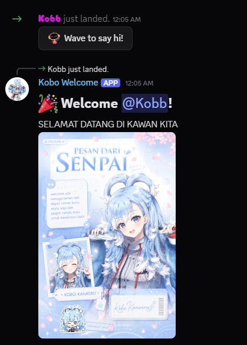

<div align="center">

# 🎉 Kobo Welcome Bot

<p align="center">
  
</p>

A Discord bot that welcomes new members **only when they send their very first message**, making the first interaction feel natural instead of interrupting them immediately after joining.


</div>

---

# ✨ Features

- 🎉 Welcome members on their **first message**
- 🖼️ Send a custom welcome poster
- 💬 Reply directly to the member's first message
- 💾 Store welcome status using JSON
- ⚡ Built with Discord.js v14
- 🔒 Environment variables support (.env)

---

# 📷 Preview

<p align="center">
  
</p>


---

# 🚀 Installation

Clone the repository

```bash
git clone https://github.com/YOUR_USERNAME/KoboWelcomeBot.git
```

Go into the project

```bash
cd KoboWelcomeBot
```

Install dependencies

```bash
npm install
```

Create a `.env` file

```env
TOKEN=YOUR_DISCORD_BOT_TOKEN
```

Run the bot

```bash
node index.js
```

---

# 📁 Project Structure

```text
KoboWelcomeBot
│
├── assets
│   └── welcome.png
│
├── data
│   ├── pending.json
│   └── welcomed.json
│
├── .env
├── .gitignore
├── index.js
├── package.json
└── package-lock.json
```

---

# 🛠️ Built With

- Node.js
- Discord.js v14
- fs-extra

---

# 💡 How It Works

```text
Member Joins
      │
      ▼
Bot waits...
      │
      ▼
Member sends first message
      │
      ▼
Bot replies with
Welcome Poster
+
Welcome Message
      │
      ▼
Member is marked as welcomed
      │
      ▼
Future messages
No more welcome messages
```

---

# ❤️ Future Plans

- 🎨 Dynamic welcome posters
- 👤 Display member avatar on poster
- 📝 Random welcome messages
- ⚙️ Config system
- 📊 Dashboard
- 🤖 AI integration
- 🎫 Ticket system
- 📈 Leveling system

---

# 📜 License

This project is licensed under the MIT License.

---

<div align="center">

Made with ❤️ using Discord.js

⭐ If you like this project, consider giving it a star!

</div>
